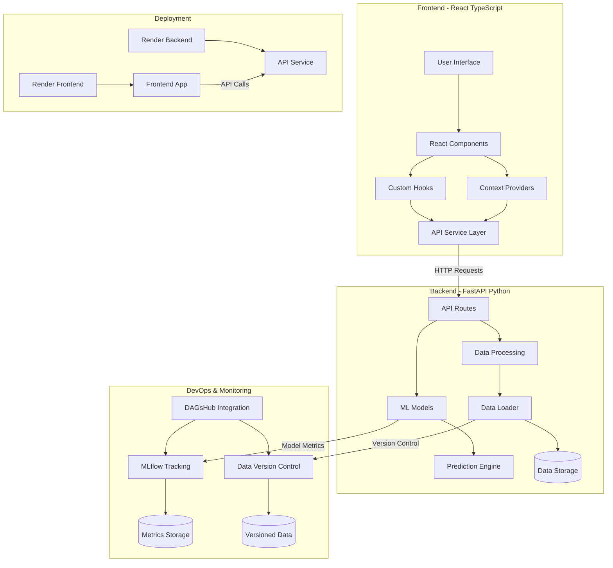

# 🌾 AgriPreserve 🌾

### Smart Storage Solution for Nigerian Agriculture

[](https://www.python.org/)
[](https://fastapi.tiangolo.com/)
[](https://gradio.app/)
[](LICENSE)

<p align="center">
  
</p>

**Reducing post-harvest losses through data-driven insights and smart storage solutions**

## 📋 Table of Contents

- [Overview](#overview)
- [Problem Statement](#problem-statement)
- [Live Application](#live-application)
- [Our Solution](#our-solution)
- [Key Features](#key-features)
- [Project Structure](#project-structure)
- [Installation](#installation)
- [Usage](#usage)
- [API Documentation](#api-documentation)
- [System Architecture](#system-architecture)
- [Data Sources](#data-sources)
- [Testing](#testing)
- [Deployment](#deployment)
- [Contributing](#contributing)
- [License](#license)

## 🔍 Overview

AgriPreserve provides tools for analyzing and visualizing post-harvest losses across different crops and regions in Nigeria. It also offers recommendations for storage solutions and market connections to reduce losses and improve farmer income.

## 🚨 Problem Statement

Nigeria loses 30-50% of agricultural produce annually due to poor storage, transportation, and processing infrastructure, costing approximately $9 billion. These post-harvest losses (PHL) discourage youth participation in agriculture and represent a significant barrier to agricultural productivity and profitability.

## 🌐 Live Application

- **Frontend**: [https://agripreserve-frontend.onrender.com](https://agripreserve-frontend.onrender.com)
- **Backend API**: [https://agripreserve-backend.onrender.com](https://agripreserve-backend.onrender.com)

## 🌟 Our Solution

AgriPreserve is a comprehensive Python package that provides data-driven insights to help farmers, agribusinesses, and policymakers make informed decisions to reduce losses and improve food security.

## 📈 Key Features

- **Data Analysis**: Analyze post-harvest losses by crop, state, and region
- **Visualization**: Generate interactive visualizations of loss data
- **Summary Statistics**: Get comprehensive statistics on post-harvest losses
- **Predictive Models**: Machine learning models to predict post-harvest losses
- **Metrics Tracking**: Track metrics using DVC and MLflow with DAGsHub integration
- **High-Opportunity Areas**: Identify areas with the highest potential for intervention
- **Storage Recommendations**: Get smart storage recommendations based on crop, location, and duration
- **Market Connections**: Find potential market connections for your crops

## 🗂️ Project Structure

The AgriPreserve project is organized into two main components: a Python backend and a React TypeScript frontend.

```
AgriPreserve/
├── backend/               # Python FastAPI backend
│   ├── agripreserve/      # Core package
│   │   ├── __init__.py
│   │   ├── __main__.py
│   │   ├── cli.py
│   │   ├── api/           # FastAPI routes and server
│   │   ├── data/          # Data loading and processing
│   │   ├── models/        # ML models
│   │   └── utils/         # Helper functions
│   ├── tests/             # Unit and integration tests
│   ├── examples/          # Example scripts
│   ├── pyproject.toml     # Project dependencies
│   ├── setup.py           # Package setup
│   └── render.py          # Render deployment script
├── frontend/             # React TypeScript frontend
│   ├── src/
│   │   ├── api/          # API service layer
│   │   ├── components/   # Reusable UI components
│   │   ├── context/      # React context providers
│   │   ├── hooks/        # Custom React hooks
│   │   ├── pages/        # Application pages/routes
│   │   ├── theme/        # UI theming
│   │   ├── types/        # TypeScript type definitions
│   │   └── utils/        # Helper utilities
│   ├── public/           # Static assets
│   └── package.json      # Frontend dependencies
├── .env                  # Environment variables
└── README.md            # Project documentation
```

## 📦 Installation

### From Source

Clone the repository and install the package:

```bash
git clone https://github.com/agripreserve/agripreserve.git
cd agripreserve
pip install -e .
```

### Using pip

```bash
pip install agripreserve
```

## 🚀 Usage

### Command Line Interface

AgriPreserve provides a command-line interface for running the application:

```bash
# Run both API and UI
agripreserve

# Run only the API
agripreserve api --host 0.0.0.0 --port 8000

# Run only the UI
agripreserve ui --api-url http://localhost:8000/api

# Run both with custom settings
agripreserve both --host 0.0.0.0 --port 8000
```

### Python API

You can also use AgriPreserve as a Python package:

```python
# Run the API
from agripreserve.api.server import run_server
run_server(host="0.0.0.0", port=8000)

# Run the UI
from agripreserve.ui.gradio_app import launch_ui
launch_ui(api_base_url="http://localhost:8000/api")

# Load and process data
from agripreserve.data.loader import load_datasets
loss_percentage_df, loss_tonnes_df = load_datasets()
```

### Example Script

Check out the `examples/basic_usage.py` file for a complete example of how to use the package programmatically:

```bash
# Run the example script
python examples/basic_usage.py
```

## 💻 API Documentation

AgriPreserve provides a RESTful API for accessing post-harvest loss data and insights. The API is built with FastAPI and provides the following endpoints:

### Base URL

```
http://localhost:8000
```

### Endpoints

| Endpoint | Method | Description | Parameters |
|----------|--------|-------------|------------|
| `/` | GET | Welcome message | None |
| `/api/crops` | GET | List of available crops | None |
| `/api/states` | GET | List of states in Nigeria | None |
| `/api/regions` | GET | List of regions in Nigeria | None |
| `/api/loss-percentage` | GET | Post-harvest loss percentages | `state`, `crop`, `region` (all optional) |
| `/api/loss-tonnes` | GET | Post-harvest loss in tonnes | `state`, `crop`, `region` (all optional) |
| `/api/summary-statistics` | GET | Summary statistics for post-harvest losses | None |
| `/api/high-opportunity-areas` | GET | High-opportunity areas for intervention | `limit` (optional, default=10) |
| `/api/crop-comparison` | GET | Compare crops by loss percentage and tonnage | None |

### Examples

```bash
# Get available crops
curl http://localhost:8000/api/crops

# Get states in Nigeria
curl http://localhost:8000/api/states

# Get post-harvest loss percentages for Maize
curl http://localhost:8000/api/loss-percentage?crop=Maize

# Get post-harvest losses in tonnes for Rice in Lagos
curl http://localhost:8000/api/loss-tonnes?crop=Rice&state=Lagos

# Get summary statistics
curl http://localhost:8000/api/summary-statistics

# Get high-opportunity areas (limited to top 5)
curl http://localhost:8000/api/high-opportunity-areas?limit=5

# Get crop comparison data
curl http://localhost:8000/api/crop-comparison
```

## 📊 System Architecture

The AgriPreserve system uses a modern architecture with a clear separation between frontend and backend components, integrated with data science tools for analytics and model tracking.



This architecture enables:

- **Clear Separation of Concerns**: Frontend and backend are decoupled but communicate through a well-defined API
- **Data Science Integration**: MLflow and DVC provide robust tracking of models and datasets
- **Scalable Deployment**: Both frontend and backend are deployed independently on Render
- **Responsive UI**: React with Material UI provides a modern, responsive interface

## 📊 Data Sources

The package uses data from the African Postharvest Losses Information System (APHLIS) for Nigeria, covering the following crops:

- **Maize**: Nigeria's most widely grown cereal crop, with significant post-harvest losses
- **Rice**: A staple food in Nigeria with high economic importance
- **Sorghum**: Drought-resistant crop commonly grown in northern Nigeria
- **Millet**: Important for food security in arid regions of Nigeria

The data includes both loss percentages and absolute losses in tonnes across all states in Nigeria for the year 2022.

## 🛠 Testing

The project includes a comprehensive test suite using pytest. To run the tests:

```bash
# Install development dependencies
pip install -e ".[dev]"

# Run the tests
python -m pytest

# Run tests with coverage report
python -m pytest --cov=agripreserve --cov-report=term-missing
```

The test suite covers:
- Data loading and processing
- API endpoints and routes
- Command-line interface

## 👮‍♂️ Security

This project follows security best practices:

- Input validation on all API endpoints
- No hardcoded credentials
- CORS protection for API endpoints

## 👥 Contributing

Contributions are welcome! Here's how you can contribute:

1. Fork the repository
2. Create a feature branch: `git checkout -b feature/your-feature-name`
3. Commit your changes: `git commit -am 'Add some feature'`
4. Push to the branch: `git push origin feature/your-feature-name`
5. Submit a pull request

Please make sure your code passes all tests and follows the project's coding style.

## Predictive Models

AgriPreserve includes machine learning models to predict post-harvest losses based on various factors:

- **Random Forest Model**: Provides accurate predictions by capturing complex relationships in the data
- **Linear Regression Model**: Offers interpretable predictions with clear feature importance

### Training the Models

You can train the models using the provided example script:

```bash
python -m agripreserve.examples.train_model_example
```

This will train both models, track them with DVC and MLflow, and display example predictions.

### Using the Models in Your Code

```python
from agripreserve.models.loss_prediction_model import LossPredictionModel

# Load a trained model
model = LossPredictionModel(model_type="random_forest")
model.load()

# Make predictions
predicted_loss = model.predict(
    state="Kano",
    region="Northern",
    crop="Maize",
    loss_tonnes=1000
)
print(f"Predicted loss percentage: {predicted_loss:.2f}%")
```

## Metrics Tracking with DVC and MLflow

AgriPreserve integrates with DVC and MLflow for data versioning and metrics tracking. This integration allows you to:

- Version your datasets with DVC
- Track experiment metrics with MLflow
- Visualize metrics on DAGsHub

### Setup

1. Set up your DAGsHub credentials:

```bash
export DAGSHUB_TOKEN=your_token_here
export DAGSHUB_REPO_URL=https://github.com/your-username/your-repo.git
```

2. Run the metrics tracking example:

```bash
python -m agripreserve.examples.track_metrics_example
```

3. View your metrics on DAGsHub by visiting your repository page.

### Using in Your Code

```python
from agripreserve.utils.metrics_tracker import MetricsTracker, setup_dagshub_credentials

# Set up credentials
setup_dagshub_credentials()

# Create tracker
tracker = MetricsTracker(
    experiment_name="your_experiment",
    dagshub_repo_url="https://github.com/your-username/your-repo.git"
)

# Track metrics
tracker.track_loss_metrics(loss_percentage_df, loss_tonnes_df)
```

## 🚀 Deployment

AgriPreserve consists of two main components that need to be deployed: the backend API and the frontend application.

### Backend Deployment

#### Option 1: Deploy to Render

1. Create a new Web Service on Render:
   - Sign in to your Render account and go to the Dashboard
   - Click on "New" and select "Web Service"
   - Connect your GitHub repository

2. Configure the Web Service:
   - Name: `agripreserve-api`
   - Environment: `Python 3`
   - Build Command: `pip install -r requirements.txt`
   - Start Command: `cd backend && uvicorn api.main:app --host 0.0.0.0 --port $PORT`

3. Add Environment Variables:
   - Click on "Environment" tab
   - Add your environment variables (DATABASE_URL, SECRET_KEY, etc.)

4. Deploy the service:
   - Click "Create Web Service"
   - Render will automatically build and deploy your application

#### Option 2: Deploy to Heroku

1. Install the Heroku CLI and log in:
   ```bash
   npm install -g heroku
   heroku login
   ```

2. Create a new Heroku app:
   ```bash
   heroku create agripreserve-api
   ```

3. Add a Procfile to the root directory:
   ```
   web: cd backend && uvicorn api.main:app --host=0.0.0.0 --port=$PORT
   ```

4. Deploy the application:
   ```bash
   git push heroku main
   ```

### Frontend Deployment

#### Option 1: Deploy to Render

1. Create a new Static Site on Render:
   - Sign in to your Render account and go to the Dashboard
   - Click on "New" and select "Static Site"
   - Connect your GitHub repository

2. Configure the Static Site:
   - Name: `agripreserve-frontend`
   - Root Directory: `frontend`
   - Build Command: `npm install && npm run build`
   - Publish Directory: `dist`

3. Add Environment Variables:
   - Click on "Environment" tab
   - Add `VITE_API_BASE_URL` pointing to your backend service URL

4. Deploy the site:
   - Click "Create Static Site"
   - Render will automatically build and deploy your frontend

#### Option 2: Deploy to Netlify

1. Install the Netlify CLI:
   ```bash
   npm install -g netlify-cli
   netlify login
   ```

2. Build the frontend:
   ```bash
   cd frontend
   npm install
   npm run build
   ```

3. Deploy to Netlify:
   ```bash
   netlify deploy --prod
   ```

### Deployment Details

### Deployment Configuration

#### Frontend Deployment (Render)

The frontend is deployed on Render with the following configuration:

- **Build Command**: `npm install && npm run build`
- **Start Command**: `npm run serve`
- **Environment Variables**: None required for basic functionality

The Vite configuration includes proper settings for the production environment, including CORS configuration to allow connections from the Render domain.

#### Backend Deployment (Render)

The backend is deployed on Render with the following configuration:

- **Root Directory**: `backend`
- **Build Command**: `pip install -e .`
- **Start Command**: `python render.py`
- **Environment Variables**:
  - `PYTHON_VERSION=3.11.11`
  - `PORT=10000`
  - Plus all the environment variables for DAGsHub and MLflow integration

### Environment Configuration

Make sure to set the following environment variables for your deployments:

#### Backend Environment Variables
- `PYTHON_VERSION`: Full Python version (e.g., `3.11.11`)
- `PORT`: Port for the backend server (e.g., `10000`)
- `DAGSHUB_USERNAME`: Your DAGsHub username
- `DAGSHUB_TOKEN`: Your DAGsHub token
- `DAGSHUB_REPO`: Your DAGsHub repository name
- `MLFLOW_TRACKING_URI`: MLflow tracking URI
- `MLFLOW_TRACKING_USERNAME`: MLflow tracking username
- `MLFLOW_TRACKING_PASSWORD`: MLflow tracking password
- `S3_BUCKET_NAME`: S3 bucket name for storage
- `S3_ENDPOINT_URL`: S3 endpoint URL
- `S3_ACCESS_KEY_ID`: S3 access key ID
- `S3_SECRET_ACCESS_KEY`: S3 secret access key
- `S3_REGION`: S3 region

#### Frontend Environment Variables
- `VITE_API_BASE_URL`: URL of your deployed backend API
- `VITE_ENVIRONMENT`: Set to 'production' for production deployments

### Continuous Integration/Continuous Deployment

#### Render Automatic Deployments

Render automatically deploys your application when you push to your connected GitHub repository. To set this up:

1. Connect your GitHub repository to Render
2. Enable automatic deployments in your Render dashboard
3. Push changes to your repository to trigger deployments

Render will automatically build and deploy both your backend and frontend whenever changes are pushed to the connected branch.

#### GitHub Actions (Alternative)

If you prefer using GitHub Actions, create a workflow file at `.github/workflows/deploy.yml`:

```yaml
name: Deploy AgriPreserve

on:
  push:
    branches: [ main ]

jobs:
  tests:
    runs-on: ubuntu-latest
    steps:
      - uses: actions/checkout@v2
      - name: Set up Python
        uses: actions/setup-python@v2
        with:
          python-version: '3.8'
      - name: Install dependencies
        run: |
          python -m pip install --upgrade pip
          pip install pytest
          if [ -f requirements.txt ]; then pip install -r requirements.txt; fi
      - name: Test with pytest
        run: |
          pytest
```

This workflow will run tests on every push to ensure your code is working correctly before Render's automatic deployment takes over.

## 📃 License

This project is licensed under the MIT License - see the LICENSE file for details.
